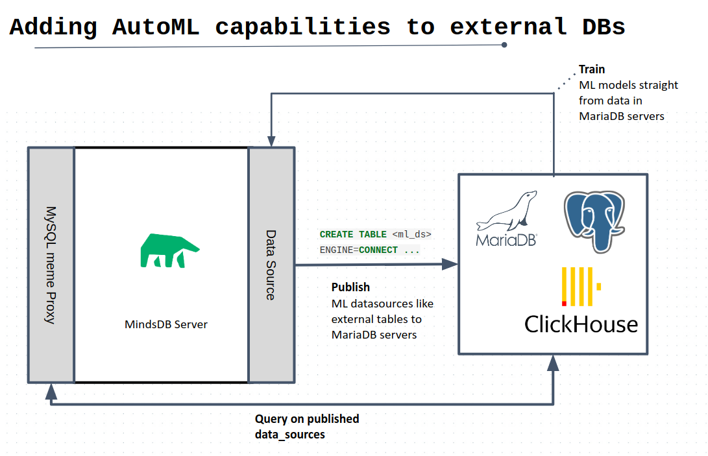

# AI Tables

Starting from MindsDB 2.0 version you can train machine learning models straight from the database by using MindsDB and the most popular database management systems like MySQL, MariaDB, PostgreSQL, ClickHouse. Any database user can now create, train and test machine learning models with the same knowledge they have of SQL. 


## AITables example

AITables differ from normal tables in that they can generate predictions upon being queried and returning such predictions like if it was data that existed on the table. Simply put, an AI-Table allows you to use machine learning models as if they were normal  database tables, in something that in plain SQL looks like this; 

```sql
 SELECT <predicted_variable> FROM <ML_model> WHERE <conditions> 
```

To really sink in this idea, let us expand the concept through an example. 

### The used car price example

Imagine that you want to solve the problem of estimating the right price for a car on your website that has been selling used cars over the past 2 years. 

The data is persistend in your database inside a table called `used_cars_data` where you keep records of every car you have sold so far, storing information such as: price, transmission, mileage, fuel_type, road_tax, mpg (Miles Per Gallon) and engine_size.  

Since you have historical data, you know that you could use Machine Learning to solve this problem. Wouldn't it be nice if you could simply tell your database server to do and manage the Machine Learning parts for you?

At MindsDB we think so too! And AI-Tables baked directly to your database are here to do exactly that.

You can for instance with a single INSERT statement, create a machine learning model/predictor trained to predict ‘price’ using the data that lives in the table `sold_cars` and publish it as an AI-Table called 'used_cars_model'.

```sql
INSERT INTO
   mindsdb.predictors(name, predict, select_data_query) 
VALUES
   ('used_cars_model', 'price', 'SELECT * FROM used_cars_data);
```

After that you can get price predictions by querying the generated 'used_cars_model' AI-Table, as follows: 

```sql
SELECT price, 
       confidence 
FROM   mindsdb.used_cars_model 
WHERE  model = "a6" 
       AND mileage = 36203 
       AND transmission = "automatic" 
       AND fueltype = "diesel" 
       AND mpg = "64.2" 
       AND enginesize = 2 
       AND year = 2016 
       AND tax = 20; 
```

As you can see with AI-Tables, we are aiming to simplify Machine Learning mechanics to simple SQL queries, so that you can focus on the important part; which is to think about what predictions you need and what data you want your ML to learn from to make such predictions. 
 


Currently, we are supporting the integration with:

* [MariaDB](MariaDB.md)
* [ClickHouse](Clickhouse.md)
* [PostgreSQL](PostgreSQL.md)
* [MySQL](MySQL.md)
